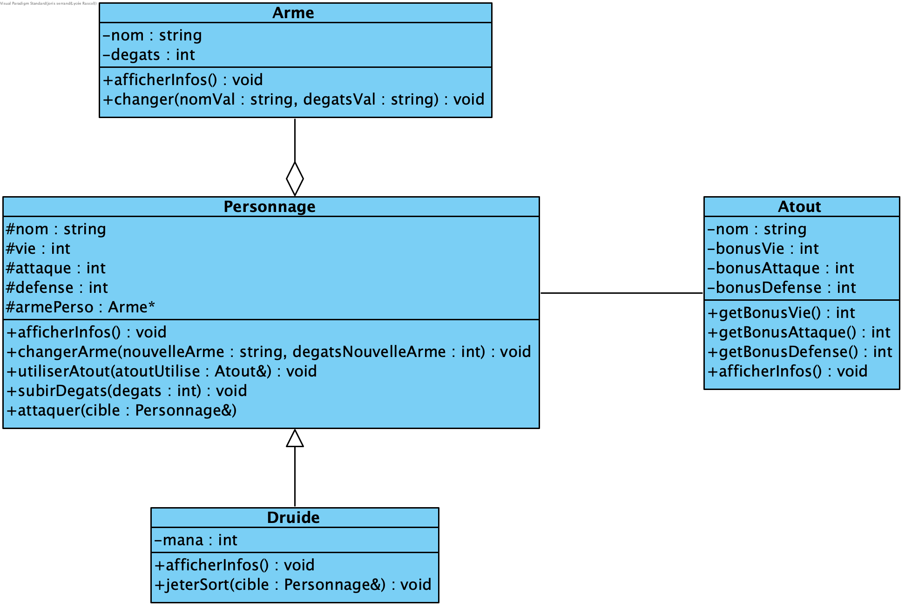

# TP 13 - Relations entre classes

Pour ce TP, vous devez implémenter en C++ le projet dont nous donnons ci-dessous le diagramme de classes UML :

Pour cela, complétez les fichiers suivants :

- Pour la classe Personnage : `Personnage.h` et `Personnage.cpp`
- Pour la classe Druide : `Druide.h` et `Druide.cpp`
- Pour la classe Arme : `Arme.h` et `Arme.cpp`
- Pour la classe Arme : `Atout.h` et `Atout.cpp`
